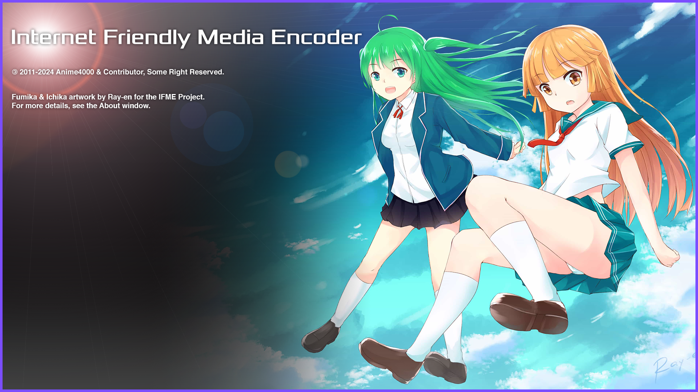

# Internet Friendly Media Encoder

## Introduction
Back in 2012, as a college student, I originally developed IFME to compress FRAPS game recordings using x264 for archiving. My friends appreciated IFME for its simplicity and lightweight design, which led to the birth of Internet Friendly Media Encoder (IFME).

## About
A versatile, future-proof, and expandable multimedia encoder designed for ease of use. Internet Friendly Media Encoder supports adding subtitles and attachments, and can function as a remuxing tool with a Copy Stream option. It allows you to combine multiple video, audio, subtitle, and attachment streams into a single file, remove unwanted streams, or incorporate subtitles from another video without extracting. The software also supports AviSynth for advanced video processing.

The video and audio encoders are implemented in a plug-in style, enabling users to add their own compiled, optimized CPU architectures for increased speed. This modular design ensures that the encoder remains adaptable and expandable, allowing for the addition of new and future encoding technologies.

## License
### Source Code & Binary
IFME Source Code under license [GPL 2.0](http://choosealicense.com/licenses/gpl-2.0/).

### Mascot & Artwork
Artwork drawn by [53C](http://53c.deviantart.com/) and [adeq](https://www.facebook.com/liyana.0426) are property of IFME Project and under license [Attribution-NonCommercial 4.0 International](http://creativecommons.org/licenses/by-nc/4.0/)

## Donation
Support this project! Even a little penny make this project alive and up-to-date!

You can donate via [my paypal](https://www.paypal.com/cgi-bin/webscr?cmd=_s-xclick&hosted_button_id=4CKYN7X3DGA7U). If you made a donation, don't forget to tell us at [Facebook](https://www.facebook.com/internetfriendlymediaencoder) or  [Twitter](https://twitter.com/Anime4000), You will be honored and listed on *Hall of Fame* and **About Program**

## You
### System Requirement
* [Microsoft Visual C++ (ALL)](https://www.techpowerup.com/download/visual-c-redistributable-runtime-package-all-in-one/)
* [Microsoft .NET Framework 4.8](https://dotnet.microsoft.com/en-us/download/dotnet-framework/net48) *Windows 7 Only*

For Ubuntu (Linux) you need:
* `mono-complete` (Mono Runtime)
* *Technically, IFME can run on Linux; however, the `Plugins` folder is built only for Windows. You might need to build your own versions of `FFmpeg`, `x264`, `x265`, etc., and replace the Windows binaries for now.*

#### 32-bit
*IFME no longer support 32-bit since High Resolution (QHD, UHD), High BitDepth require very large RAM*

#### 64-bit
* OS: 64-bit Windows 10 & Linux (Ubuntu, etc...)
* CPU: Intel Core i9 10th Gen or AMD Ryzen 7 3700X
* RAM:  8GB DDR4 (QHD and below)
* RAM: 16GB DDR4 (UHD and above)
* HDD: 70GB (UHD, HDR temp disk)

## Downloads
You can download it @
* [SourceForge (Release)](https://sourceforge.net/projects/ifme/files/latest/download)
* [GitHub (Release)](https://github.com/Anime4000/IFME/releases/latest)
* [VideoHelp](https://www.videohelp.com/software/Internet-Friendly-Media-Encoder)
* [SoftPedia](https://www.softpedia.com/get/Multimedia/Video/Encoders-Converter-DIVX-Related/Internet-Friendly-Media-Encoder.shtml)

> [!NOTE]
> VideoHelp & SoftPedia might take time to have latest version, since I not manage the page, however SourceForge is always have latest version, sometime I forgot to release on GitHub Release

### Run
Windows users simply execute `ifme.exe`, meanwhile Linux users simply execute `ifme.sh` via Terminal Emulator

## Hardware Acceleration
Internet Friendly Media Encoder includes built-in hardware acceleration for H264, H265, and AV1 using FFmpeg and [Rigaya](https://github.com/rigaya).

> [!WARNING]
> For high-efficiency encoding (high quality + low bit rate), it is recommended to use CPU-based encoders. Hardware acceleration offers faster encoding speeds but may compromise on quality and bit rate efficiency.

## Developer
Clone this project and open `ifme.sln` via Visual Studio 2022, by default VS2022 will download `Newtonsoft.Json` from nuget automatically.
