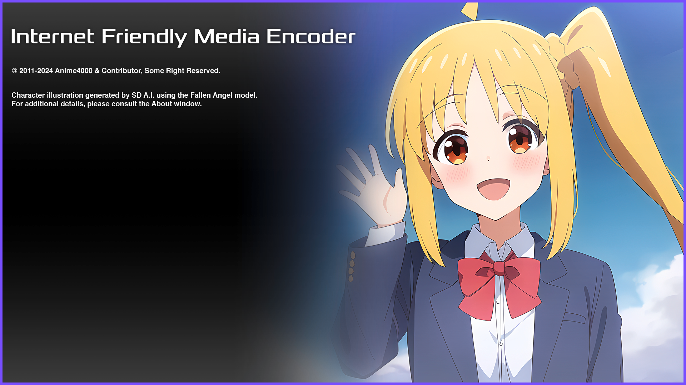
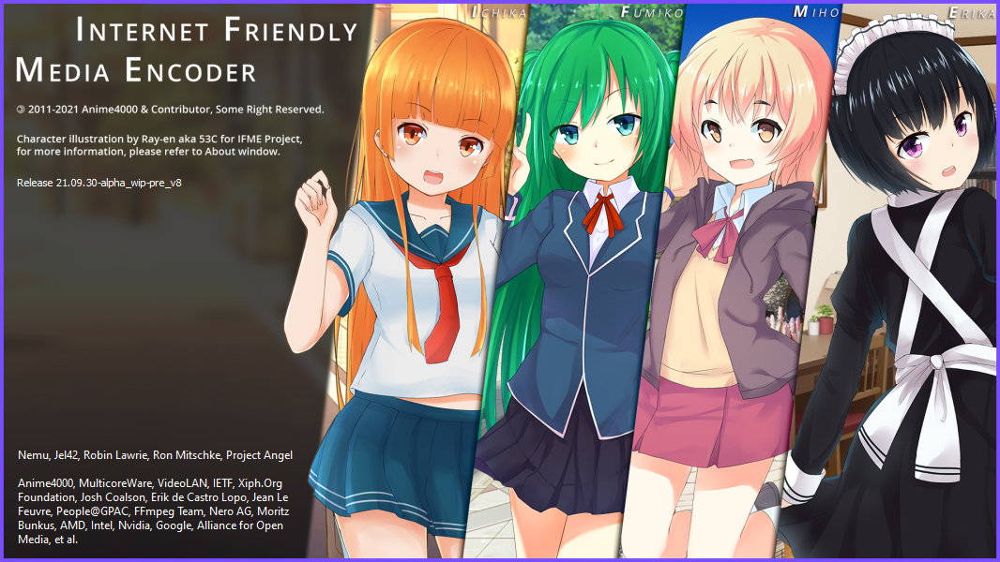

# Internet Friendly Media Encoder


## Introduction
Back on 2012 as college student, I originally developed IFME for compressing FRAPS game recordings by using x264 for archiving, my friends showing that IFME simple and lightweight, from that IFME was born.

## License
IFME Source Code under license [GPL 2.0](http://choosealicense.com/licenses/gpl-2.0/).<br>However you are not allowed to sell either **Source Code** or **Binaries**.

Artwork drawn by [53C](http://53c.deviantart.com/) and [adeq](https://www.facebook.com/liyana.0426) are property of IFME Project and under license [Attribution-NonCommercial 4.0 International](http://creativecommons.org/licenses/by-nc/4.0/)

## Donation
Support this project! Even a little penny make this project alive and up-to-date!

You can donate via [my paypal](https://www.paypal.com/cgi-bin/webscr?cmd=_s-xclick&hosted_button_id=4CKYN7X3DGA7U). If you made a donation, don't forget to tell us at [Facebook](https://www.facebook.com/internetfriendlymediaencoder) or  [Twitter](https://twitter.com/Anime4000), You will be honored and listed on *Hall of Fame* and **About Program**

## You
### System Requirement
For Windows 7, you need:
* Microsoft Visual C++ (ALL)
* Microsoft .NET Framework 4.8

For Ubuntu, Linux, you need:
* `mono-complete` (Mono Runtime)

#### 32-bit
*IFME no longer support 32-bit since High Resolution (QHD, UHD), High BitDepth require very large RAM*

#### 64-bit
* OS: 64-bit Windows 10 & Linux (Ubuntu, etc...)
* CPU: Intel Core i9 10th Gen or AMD Ryzen 7 3700X
* RAM:  8GB DDR4 (QHD and below)
* RAM: 16GB DDR4 (UHD and above)
* HDD: 70GB (UHD, HDR temp disk)

```
IFME was build and compiled under Zen 2 Architecture, likely run very poor on non-Ryzen system, I strongly advice you to compile own x265 aginst own processor for maximum performance
```

### Downloads
You can download it via [SourceForge (Release)](https://sourceforge.net/projects/ifme/files/latest/download) or [GitHub (Build from Source)](https://github.com/Anime4000/IFME/releases/latest)

#### Hardware Acceleration
You can get Hardware Acceleration plugin [here!](https://sourceforge.net/projects/ifme/files/plugin/plugin-hwenc_2017-06-27.7z/download) simply extract to plugin folder.

Using Hardware Acceleration/Fixed Encoder **NEVER** gives you better compression quality like x264 & x265 do, they are aimed for Live Streaming or Broadcasting or anything needing very fast encoding with decent quality.

### Run
Windows users simply execute `ifme.exe`, meanwhile Linux users simply execute `ifme.sh` via Terminal Emulator

*IFME require Console or Terminal (tty), please run with it.*

## Developer
### Do this before opening project

* [Clone](https://github.com/JamesNK/Newtonsoft.Json) Json.NET
* [Download](https://sourceforge.net/projects/ifme/files/plugin/) Plugin

Make sure clone these in same folder with `ifme`, so it will look like:
```
GitHub
  `-|
    |
    |`- IFME
    |
     `- Newtonsoft.Json
```
Then you can open `ifme.sln`. Have fun!

### Compiling
```
mkdir ~/GitHub
cd ~/GitHub
git clone https://github.com/Anime4000/IFME
cd IFME
./configure
make
```
Simple as that, if show an error, try download and install then run again.

## Version History
### Version 7
You can find [here](https://github.com/Anime4000/IFME/tree/ifme7.7) or change `master` to `ifme7.7`.

### Version 6
You can find [here](https://github.com/Anime4000/IFME/tree/ifme6) or change `master` to `ifme6`.

### Version 5
You can find [here](https://github.com/Anime4000/IFME/tree/ifme6) or change `master` to `ifme5`.

### Version 4
You can find [here](https://github.com/Anime4000/IFME/tree/ifme4) or change `master` to `ifme4`.
