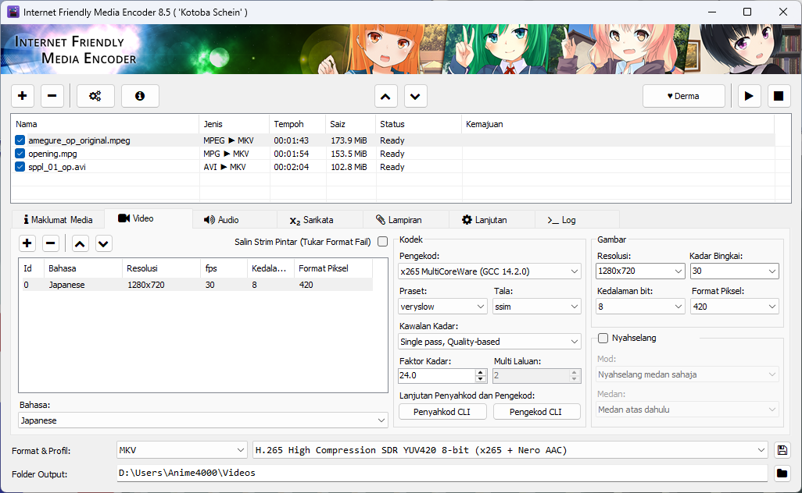

# Internet Friendly Media Encoder

**Bahasa:** [English](/README.md) | [日本語](/README_ja-JP.md) | [简体中文](/README_zh-CN.md)

## Pengenalan
Pada tahun 2012, semasa saya masih seorang pelajar universiti, saya membangunkan IFME untuk memampatkan rakaman permainan *FRAPS* menggunakan *x264* bagi tujuan arkib. Rakan-rakan saya menyukai IFME kerana reka bentuknya yang ringkas dan ringan, lalu lahirlah Internet Friendly Media Encoder (*IFME*).

## Mengenai
*IFME* ialah pengekod multimedia yang serba boleh, tahan masa depan, dan boleh dikembangkan, yang direka khas untuk kemudahan penggunaan. *Internet Friendly Media Encoder* menyokong penambahan sari kata dan lampiran, serta boleh berfungsi sebagai alat *remuxing* dengan pilihan *Copy Stream*. Anda boleh menggabungkan beberapa aliran video, audio, sari kata, dan lampiran ke dalam satu fail, membuang aliran yang tidak diperlukan, atau menambahkan sari kata dari video lain tanpa perlu mengekstraknya. *IFME* juga menyokong *AviSynth* untuk pemprosesan video lanjutan.

Penekan video dan audio diimplementasikan dalam gaya *plugin*, membolehkan pengguna menambah binaan sendiri yang dioptimumkan untuk seni bina *CPU* demi kelajuan yang lebih tinggi. Reka bentuk modular ini memastikan *encoder* kekal boleh disesuaikan dan dikembangkan, serta membolehkan penambahan teknologi pengekodan baharu dan masa hadapan.

## Lesen
### Kod Sumber & Binaan
Kod sumber *IFME* dilesenkan di bawah [GPL 2.0](http://choosealicense.com/licenses/gpl-2.0/).

### Maskot & Karya Seni
Karya seni oleh [53C](http://53c.deviantart.com/) dan [adeq](https://www.facebook.com/liyana.0426) adalah milik Projek *IFME* dan dilesenkan di bawah [Attribution-NonCommercial 4.0 International](http://creativecommons.org/licenses/by-nc/4.0/).

## Derma
Sokong projek ini! Sumbangan walaupun kecil boleh membantu projek ini terus hidup dan sentiasa dikemas kini!

Anda boleh menderma melalui [PayPal saya](https://www.paypal.com/cgi-bin/webscr?cmd=_s-xclick&hosted_button_id=4CKYN7X3DGA7U). Jika anda telah menderma, jangan lupa untuk maklumkan kami di [Facebook](https://www.facebook.com/internetfriendlymediaencoder) atau [Twitter](https://twitter.com/Anime4000). Nama anda akan dihormati dan disenaraikan di *Hall of Fame* dan **Tentang Program**.

## Anda
### Keperluan Sistem
* [*Microsoft Visual C++ (ALL)*](https://www.techpowerup.com/download/visual-c-redistributable-runtime-package-all-in-one/)
* [*Microsoft .NET Framework 4.8*](https://dotnet.microsoft.com/en-us/download/dotnet-framework/net48) *Windows 7 sahaja*

Untuk Ubuntu (Linux), anda perlukan:
* *mono-complete* (*Mono Runtime*)
* *Secara teknikal, IFME boleh dijalankan di Linux; namun folder *Plugins* hanya dibina untuk Windows. Anda mungkin perlu bina sendiri versi *FFmpeg*, *x264*, *x265*, dsb. dan menggantikan binaan Windows buat sementara waktu.*

#### 32-bit
*IFME tidak lagi menyokong 32-bit kerana resolusi tinggi (QHD, UHD) dan *BitDepth* tinggi memerlukan RAM yang besar.*

#### 64-bit
* OS: Windows 10 64-bit & Linux (Ubuntu, dll.)
* CPU: Intel Core i9 Gen-10 atau AMD Ryzen 7 3700X
* RAM:  8GB DDR4 (untuk QHD dan ke bawah)
* RAM: 16GB DDR4 (untuk UHD dan ke atas)
* HDD: 70GB (untuk cakera sementara UHD, HDR)

## Muat Turun
Anda boleh memuat turun di:
* [SourceForge (Release)](https://sourceforge.net/projects/ifme/files/latest/download)
* [GitHub (Release)](https://github.com/Anime4000/IFME/releases/latest)
* [VideoHelp](https://www.videohelp.com/software/Internet-Friendly-Media-Encoder)
* [SoftPedia](https://www.softpedia.com/get/Multimedia/Video/Encoders-Converter-DIVX-Related/Internet-Friendly-Media-Encoder.shtml)

> [!NOTA]
> *VideoHelp* & *SoftPedia* mungkin lambat mendapat versi terkini kerana saya tidak mengurus laman mereka. *SourceForge* sentiasa mempunyai versi terbaru, kadang-kadang saya lupa muat naik di *GitHub Release*.

### Jalankan
Pengguna Windows hanya perlu jalankan `ifme.exe`, manakala pengguna Linux jalankan `ifme.sh` melalui *Terminal Emulator*.

## Pecutan Perkakasan
*Internet Friendly Media Encoder* menyokong *hardware acceleration* terbina dalam untuk *H264*, *H265*, dan *AV1* menggunakan *FFmpeg* dan [*Rigaya*](https://github.com/rigaya).

> [!AMARAN]
> Untuk pengekodan berkecekapan tinggi (kualiti tinggi + bit rate rendah), disarankan guna *CPU-based encoder*. *Hardware acceleration* lebih laju, tetapi mungkin menjejaskan kualiti dan kecekapan bit rate.

## Pembangun
*Klon* projek ini dan buka `ifme.sln` menggunakan *Visual Studio 2022*. Secara lalai, *VS2022* akan memuat turun *Newtonsoft.Json* dari *nuget* secara automatik.
