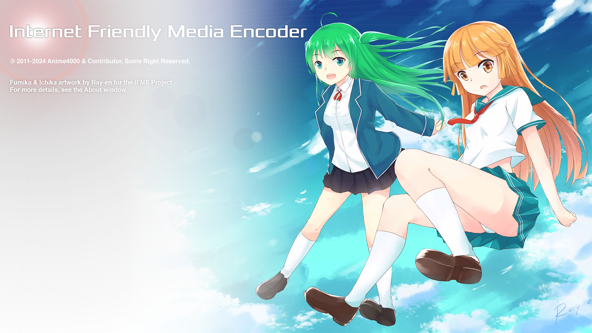
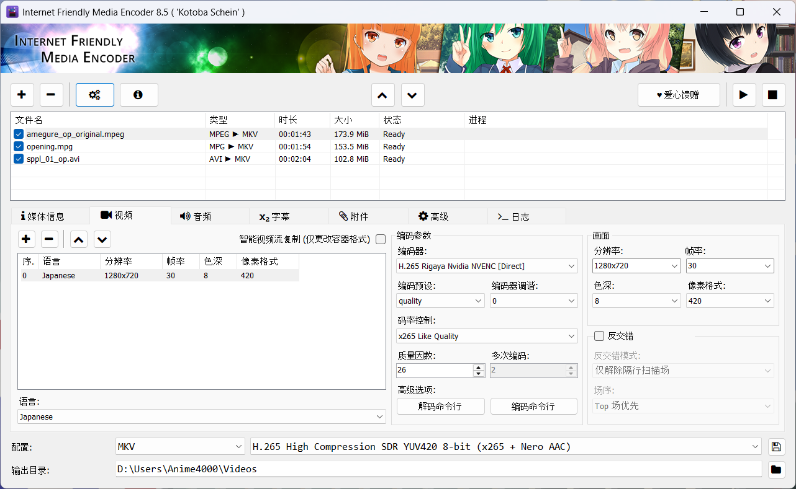

# Internet Friendly Media Encoder

**Language:** [English](/README.md) | [日本語](/README_ja-JP.md) | [Bahasa Malaysia](/README_ms-MY.md)

## 简介
早在 2012 年，作为一名大学生，我开发了IFME，最初是为了用 x264 压缩 FRAPS 游戏录像以归档。我的朋友们很欣赏 IFME 设计的简洁与轻便，这促进了 Internet Friendly Media Encoder (IFME) 的诞生。

## 关于
这是一个多功能、面向未来、可扩展的，且易于使用的多媒体编码软件。Internet Friendly Media Encoder 支持添加字幕和附件，并且带有“复制流”选项可以作为混流工具。它允许你将多个视频、音频、字幕和附件流合并到单个文件中，移除不需要的流，或者合并来自另一个视频的字幕而无需提取。该软件还支持 AviSynth 以进行高级音视频处理。

IFME 以插件形式调用视频和音频编码器，用户可添加自行编译的、针对特定硬件优化的编码器，以提高速度。这种模块化设计确保了 IFME 有很好的适应性和可扩展性，从而可以紧随新的乃至未来的编码技术。

## 许可证
### 源代码和二进制文件
IFME 源代码采用许可证 [GPL 2.0](http://choosealicense.com/licenses/gpl-2.0/)。

### 吉祥物和美术作品
由 [53C](http://53c.deviantart.com/) 和 [adeq](https://www.facebook.com/liyana.0426) 绘制的美术作品是 IFME 项目的财产，并采用许可证 [Attribution-NonCommercial 4.0 International](http://creativecommons.org/licenses/by-nc/4.0/)。

## 捐赠
请支持这个项目！绵薄之助也能让这个项目保持活力和更新！

你可以爱心捐赠 [my paypal](https://www.paypal.com/cgi-bin/webscr?cmd=_s-xclick&hosted_button_id=4CKYN7X3DGA7U)。 如果你贡献了爱心，请不要忘记在 [Facebook](https://www.facebook.com/internetfriendlymediaencoder) 或 [Twitter](https://twitter.com/Anime4000) 上告诉我们，你将荣列于 **名人堂** 和 **关于程序** 中。

## 需知
### 系统要求
* [Microsoft Visual C++ (全部)](https://www.techpowerup.com/download/visual-c-redistributable-runtime-package-all-in-one/)
* [Microsoft .NET Framework 4.8](https://dotnet.microsoft.com/en-us/download/dotnet-framework/net48) *仅 Windows 7*

对于 Ubuntu (Linux)，你需要：
* `mono-complete` (Mono 运行时)
* *从技术上讲，IFME 可以在 Linux 上运行；但是，“Plugins”文件夹中的编码器与解码器仅为 Windows 构建。你可能需要构建自己的 `FFmpeg`、`x264`、`x265` 等程序，并替换相应的插件。*

#### 32位
*IFME 不再支持 32 位，因为高分辨率 (QHD、UHD)、高位深度需要非常大的 RAM*

#### 64位
* 操作系统：64 位 Windows 10 和 Linux (Ubuntu 等...)
* CPU：Intel Core i9 第 10 代或 AMD Ryzen 7 3700X
* 内存：8GB DDR4 (QHD 及以下)
* 内存：16GB DDR4 (UHD 及以上)
* 硬盘：70GB (UHD, HDR 临时磁盘空间)

## 下载
你可以在以下位置下载：
* [SourceForge (发布)](https://sourceforge.net/projects/ifme/files/latest/download)
* [GitHub (发布)](https://github.com/Anime4000/IFME/releases/latest)
* [VideoHelp](https://www.videohelp.com/software/Internet-Friendly-Media-Encoder)
* [SoftPedia](https://www.softpedia.com/get/Multimedia/Video/Encoders-Converter-DIVX-Related/Internet-Friendly-Media-Encoder.shtml)

> [!NOTE]
> VideoHelp 和 SoftPedia 可能需要一些时间才能获得最新版本，因为我没有管理这些页面，但 SourceForge 始终拥有最新版本，有时我可能会忘记在 GitHub Release 上发布。

### 运行
Windows 用户只需执行 `ifme.exe`，而 Linux 用户需通过终端执行 `ifme.sh`。

## 硬件加速
Internet Friendly Media Encoder 包括使用 FFmpeg 和 [Rigaya](https://github.com/rigaya) 实现的 H264、H265 和 AV1 的内置硬件加速编码器。

> [!WARNING]
> 对于高效编码（高质量 + 低比特率），建议使用基于 CPU 的编码器。硬件加速提供更快的编码速度，但可能会在质量和码率方面做出妥协。

## 开发者
克隆此项目后用 Visual Studio 2022 打开 `ifme.sln`。默认情况下，VS2022 将自动从 nuget 下载 `Newtonsoft.Json`。
